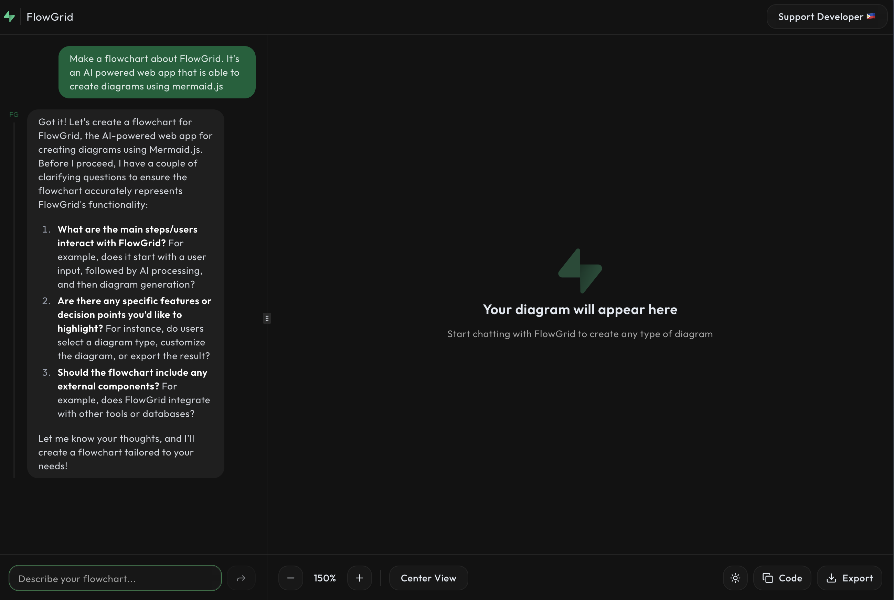
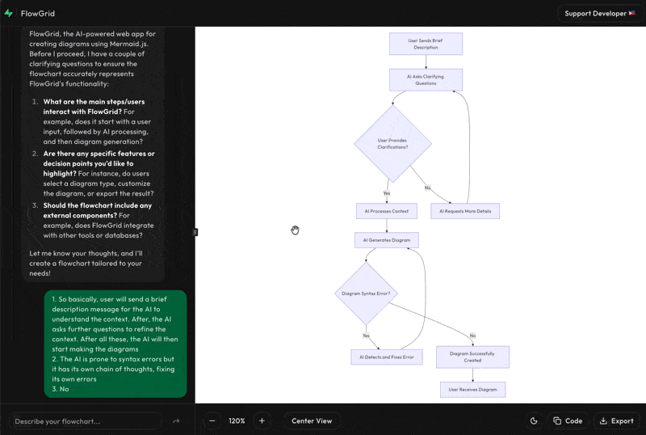

# 🎨 FlowGrid

**FlowGrid** is an AI-powered diagram generation tool that allows you to create professional Mermaid diagrams through natural conversation. Built with Next.js, it supports all types of diagrams including flowcharts, sequence diagrams, ER diagrams, and more!



## 🎬 Demo



## ✨ Features

- 🤖 **AI-Powered Generation** - Conversational interface using DeepSeek Chat via OpenRouter
- 📊 **All Diagram Types** - Supports flowcharts, sequence diagrams, ER diagrams, state diagrams, Gantt charts, mindmaps, and more
- 🎯 **Interactive Canvas** - Drag, zoom, and explore your diagrams
- 🌓 **Dual Theme Support** - Switch between light and dark modes for diagrams
- 📝 **Markdown Support** - Rich text formatting in AI responses
- 💾 **Export to PNG** - Download your diagrams in high quality
- 📋 **Copy Mermaid Code** - Easily copy diagram code for use elsewhere
- 🔄 **Auto Error Recovery** - AI automatically fixes syntax errors in generated diagrams
- 📱 **Responsive Design** - Works seamlessly across desktop and mobile

## 🚀 Getting Started

### Prerequisites

- Node.js 18+ installed
- An OpenRouter API key ([Get one here](https://openrouter.ai/))

### Installation

1. **Clone the repository**
   ```bash
   git clone https://github.com/jeiwinfrey/flowgrid
   cd flowgrid
   ```

2. **Install dependencies**
   ```bash
   npm install
   ```

3. **Set up environment variables**
   
   Create a `.env.local` file in the root directory:
   ```bash
   cp .env.local.example .env.local
   ```
   
   Then edit `.env.local` and add your OpenRouter API key:
   ```env
   OPENROUTER_API_KEY=your_openrouter_api_key_here
   NEXT_PUBLIC_SITE_URL=http://localhost:3000
   ```

   **How to get your OpenRouter API key:**
   - Go to [OpenRouter](https://openrouter.ai/)
   - Sign up or log in
   - Navigate to [Keys](https://openrouter.ai/keys)
   - Create a new API key
   - Copy and paste it into your `.env.local` file

4. **Run the development server**
   ```bash
   npm run dev
   ```

5. **Open your browser**
   
   Navigate to [http://localhost:3000](http://localhost:3000)

## 🎯 Usage

### Creating Your First Diagram

1. **Start a conversation** - Type a description of what you want to create:
   - "Create a login flowchart"
   - "Show me a sequence diagram for user authentication"
   - "Design an ER diagram for a blog database"

2. **Clarify details** - The AI will ask clarifying questions to understand your needs better

3. **Generate** - Once the AI has enough information, it will generate your diagram

4. **Refine** - Ask for modifications or adjustments as needed

### Diagram Controls

- **Zoom In/Out** - Use the `+` and `-` buttons to adjust zoom level
- **Drag to Pan** - Click and drag the diagram canvas to move around
- **Center View** - Reset zoom and position to default
- **Toggle Theme** - Switch between light and dark modes
- **Copy Code** - Copy the Mermaid code to your clipboard
- **Export PNG** - Download your diagram as a high-quality PNG image

## 📚 Supported Diagram Types

FlowGrid supports all Mermaid diagram types:

- **Flowcharts** - Process flows, algorithms, decision trees
- **Sequence Diagrams** - API interactions, user flows
- **Class Diagrams** - Object-oriented design, database schemas
- **State Diagrams** - State machines, lifecycle flows
- **Entity Relationship Diagrams** - Database relationships
- **User Journey** - User experience flows
- **Gantt Charts** - Project timelines, schedules
- **Pie Charts** - Data distribution
- **Requirement Diagrams** - Requirements analysis
- **Gitgraph** - Git branching strategies
- **Mindmaps** - Brainstorming, concept mapping
- **Timeline** - Historical events, roadmaps
- **Quadrant Charts** - Priority matrices, analysis

## 🛠️ Tech Stack

- **Framework**: [Next.js 15](https://nextjs.org/)
- **Styling**: [Tailwind CSS](https://tailwindcss.com/) with [Shadcn UI](https://ui.shadcn.com/)
- **Diagrams**: [Mermaid.js](https://mermaid.js.org/)
- **AI**: [OpenRouter](https://openrouter.ai/) with DeepSeek Chat
- **Font**: [Outfit](https://fonts.google.com/specimen/Outfit)
- **Notifications**: [Sonner](https://sonner.emilkowal.ski/)
- **Markdown**: [react-markdown](https://github.com/remarkjs/react-markdown)

## 📁 Project Structure

```
flowgrid/
├── src/
│   ├── app/
│   │   ├── api/chat/         # AI chat API endpoint
│   │   ├── globals.css       # Global styles & Tailwind config
│   │   ├── layout.tsx        # Root layout with fonts
│   │   └── page.tsx          # Main page
│   ├── components/
│   │   ├── forms/
│   │   │   ├── chat-panel.tsx      # AI chat interface
│   │   │   ├── diagram-panel.tsx   # Diagram display & controls
│   │   │   ├── resizeable-body.tsx # Resizable layout
│   │   │   └── support-dialog.tsx  # Support developer dialog
│   │   └── ui/
│   │       ├── mermaid-diagram.tsx # Mermaid renderer
│   │       └── ...                 # Shadcn UI components
│   └── lib/
│       ├── ai-service.ts      # OpenRouter AI integration
│       ├── mermaid-utils.ts   # Mermaid initialization & rendering
│       ├── export-diagram.ts  # PNG export functionality
│       └── utils.ts           # Utility functions
├── public/                    # Static assets
├── .env.local                 # Environment variables (create this)
└── package.json
```

## 🙏 Acknowledgments

- Built with ❤️ by [Jeiwinfrey Ulep](mailto:jeiwinfreyulep12@gmail.com)
- Powered by [OpenRouter](https://openrouter.ai/)
- UI components from [Shadcn UI](https://ui.shadcn.com/)

